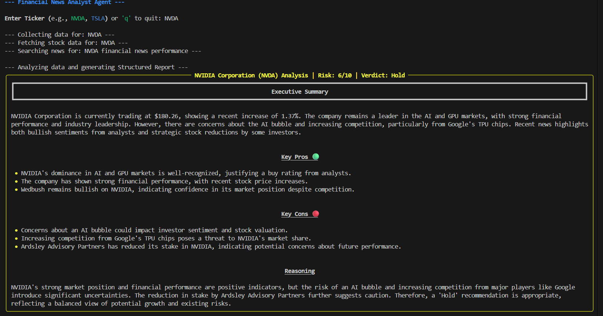
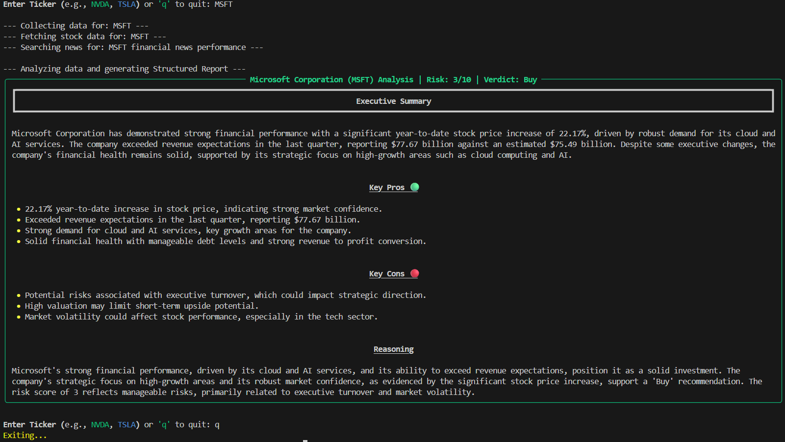

# Capstone Project: The Intelligent Financial News Analyst

## Overview
The **Financial News Analyst** is an intelligent agent designed to assist investors by automating the research process. It accepts a company name (e.g., "Tesla", "Apple") as input and performs a multi-step analysis:
1.  **Fetches real-time stock data** using a custom tool.
2.  **Researches recent news** using a search engine (Tavily) to find relevant articles about the company's performance, risks, and opportunities.
3.  **Synthesizes the information** into a structured investment memo, providing a summary, key risks, and a tentative "Buy/Hold/Sell" sentiment score.

## Reason for picking up this project
This project directly aligns with the core concepts of MAT496:
* **LangGraph:** It uses a graph architecture to orchestrate the flow from data fetching to research to analysis.
* **Tool Calling:** It requires custom tools to interact with external data sources (stock API and Search).
* **RAG / Search:** It retrieves unstructured text (news articles) to ground the LLM's generation.
* **Structured Output:** It enforces a specific schema for the final report to ensure reliability.

## Plan

I plan to execute these steps over 5 days to complete my project.

- [DONE] **Day 1: Project Initialization & State Design**
  - Initialize the repository and environment.
  - Define the `GraphState` to hold company data, news, and the final report.

- [DONE] **Day 2: Tool Implementation**
  - Implement `get_stock_prices`: A tool to fetch current market data.
  - Implement `search_market_news`: A tool to retrieve relevant financial news.

- [DONE] **Day 3: Node Logic & Agents**
  - Build the `DataCollector` node to execute tools.
  - Build the `FinancialAnalyst` node to process data and generate insights.

- [DONE] **Day 4: Graph Construction & Flow**
  - Define the workflow edges (Start -> DataCollector -> Analyst -> End).
  - Compile and visualize the graph.

- [DONE] **Day 5: Structured Output & Polish**
  - Implement Pydantic models to force the final output into a structured JSON format.
  - Final testing and documentation.

## Conclusion
I successfully built an autonomous financial analysis agent. The project demonstrates the power of LangGraph for orchestrating complex workflows (Data -> Analysis). By integrating custom tools with `yfinance` and `Tavily`, the agent accesses real-time data. Finally, using LangChain's `with_structured_output`, I ensured the agent produces reliable, machine-readable investment memos, satisfying all course requirements.

## demo
 
